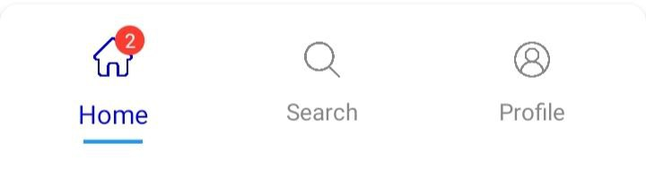
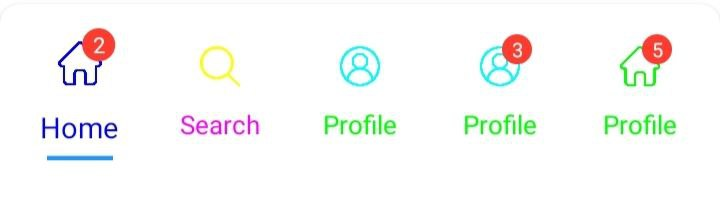

# CustomBottomNavView
[](https://kotlinlang.org/)
[](LICENSE)
[](#)
---

`CustomBottomNavView` is a fully customizable, lightweight, and animated Bottom Navigation component for Android built in **Kotlin**. It is designed for modern apps that need more flexibility and visual control than the default `BottomNavigationView`.

It supports **2 to 6 tabs**, **badges**, **custom fonts**, **smooth animations**, **custom shapes**, and **gradient backgrounds** — all controlled via XML attributes or programmatically.

---

## Preview




---

## ✨ Features

✅ Supports **2 – 6 tabs**  
✅ Smooth **scale animation** on selection  
✅ **Custom corner radius** (top & bottom independently)  
✅ **Custom text size & icon size**  
✅ **Badge support** on each tab  
✅ **Custom font (fontFamily)**  
✅ **Active indicator bar**  
✅ **Custom padding (Start, Top, End, Bottom)**  
✅ **Solid color or Gradient background**  
✅ **On tab selected listener**  
✅ Minimum height automatically enforced (58dp)


---

## 📂 Files Included

* `CustomBottomNavView.kt` → Main custom view class
* `bottom_nav_item.xml` → Each tab layout
* `attrs.xml` → Custom XML attributes
* `BottomNavItem.kt` → Tab data model

---

## 🧩 Installation

**Just Add Dependency**
```
dependencies {
implementation("com.github.Excelsior-Technologies-Community:CustomBottomNavigation:1.0.0")
}
```

---

## 🧾 XML Usage

```
<com.ext.custombottomnav.CustomBottomNavView
    android:id="@+id/customBottomNav"
    android:layout_width="match_parent"
    android:layout_height="wrap_content"
    android:layout_gravity="bottom"

    app:tabRadiusTop="24dp"
    app:tabRadiusBottom="24dp"
    app:tabTextSize="12sp"
    app:iconSize="24dp"
    app:tabBackgroundColor="#FFFFFF"
    app:indicatorColor="#2979FF"
    app:activeTabScale="1.2"
    app:animationDuration="200"
    app:tabFontFamily="@font/poppins"
    />
```

---

## 🏗 Kotlin Usage

```
val nav = findViewById<CustomBottomNavView>(R.id.customBottomNav)

val tabs = listOf(
    BottomNavItem("Home", ContextCompat.getDrawable(this, R.drawable.ic_home)!!),
    BottomNavItem("Search", ContextCompat.getDrawable(this, R.drawable.ic_search)!!),
    BottomNavItem("Profile", ContextCompat.getDrawable(this, R.drawable.ic_user)!!)
)

nav.setTabs(tabs)

// Listener
nav.setOnTabSelectedListener { index ->
    when(index){
        0 -> openHome()
        1 -> openSearch()
        2 -> openProfile()
    }
}
```

---

## 🎨 Customisation Options (XML Attributes)

| Attribute            | Description          | Type           | Example       |
| -------------------- | -------------------- | -------------- | ------------- |
| `tabRadiusTop`       | Top corner radius    | dimension      | 24dp          |
| `tabRadiusBottom`    | Bottom corner radius | dimension      | 24dp          |
| `tabTextSize`        | Tab label size       | dimension      | 12sp          |
| `iconSize`           | Icon height & width  | dimension      | 24dp          |
| `tabBackgroundColor` | Nav bar background   | color          | #FFFFFF       |
| `indicatorColor`     | Selected line color  | color          | #2979FF       |
| `activeTabScale`     | Scale on selection   | float          | 1.3           |
| `animationDuration`  | Animation time       | integer        | 250           |
| `tabFontFamily`      | Custom font          | font reference | @font/poppins |

---

## 🔵 Gradient Background

You can apply a gradient background programmatically:

```
customBottomNav.setNavBarGradient(
        intArrayOf(Color.parseColor("#1D2671"), Color.parseColor("#C33764")),
        GradientDrawable.Orientation.LEFT_RIGHT
)
```

---

## 📦 Padding Customisation (Programmatic)

```
customBottomNav.setNavPadding(
    startDp = 8,
    topDp = 6,
    endDp = 8,
    bottomDp = 6
)
```

---

## 🔔 Badge Support

To show badge on a tab:

```
BottomNavItem(
   title = "Notifications",
   icon = drawable,
   badgeCount = 5
)
```

If `badgeCount > 0`, badge will be visible automatically.

---

## ✅ Tab Limits

You **must** provide between **2 and 6 tabs** only:

```
require(tabList.size in 2..6) { "Tabs must be between 2 and 6" }
```

---

## 🔧 BottomNavItem Model Example

```
data class BottomNavItem(
    val title: String,
    val icon: Drawable,
    val badgeCount: Int = 0,
    val selectedIconColor: Int = Color.BLUE,
    val unSelectedIconColor: Int = Color.GRAY,
    val selectedTextColor: Int = Color.BLUE,
    val unSelectedTextColor: Int = Color.GRAY
)
```

---

## 💡 Best For

* Custom UI apps
* Smart Home apps
* Finance & Banking apps
* Social media apps
* Admin dashboards
* Gaming apps

---

## License

```
MIT License

Copyright (c) 2025 Excelsior Technologies 

Permission is hereby granted, free of charge, to any person obtaining a copy
of this software and associated documentation files (the "Software"), to deal
in the Software without restriction, including without limitation the rights
to use, copy, modify, merge, publish, distribute, sublicense, and/or sell
copies of the Software, and to permit persons to whom the Software is
furnished to do so, subject to the following conditions:

The above copyright notice and this permission notice shall be included in all
copies or substantial portions of the Software.

THE SOFTWARE IS PROVIDED "AS IS", WITHOUT WARRANTY OF ANY KIND, EXPRESS OR
IMPLIED, INCLUDING BUT NOT LIMITED TO THE WARRANTIES OF MERCHANTABILITY,
FITNESS FOR A PARTICULAR PURPOSE AND NONINFRINGEMENT. IN NO EVENT SHALL THE
AUTHORS OR COPYRIGHT HOLDERS BE LIABLE FOR ANY CLAIM, DAMAGES OR OTHER
LIABILITY, WHETHER IN AN ACTION OF CONTRACT, TORT OR OTHERWISE, ARISING FROM,
OUT OF OR IN CONNECTION WITH THE SOFTWARE OR THE USE OR OTHER DEALINGS IN THE
SOFTWARE.
```
